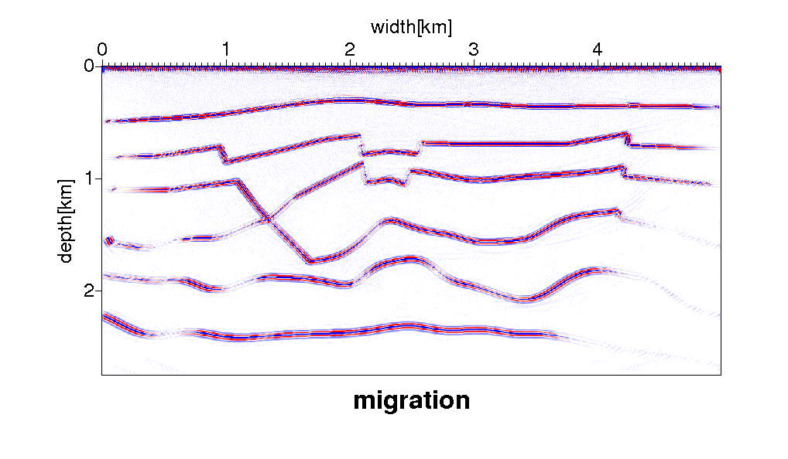
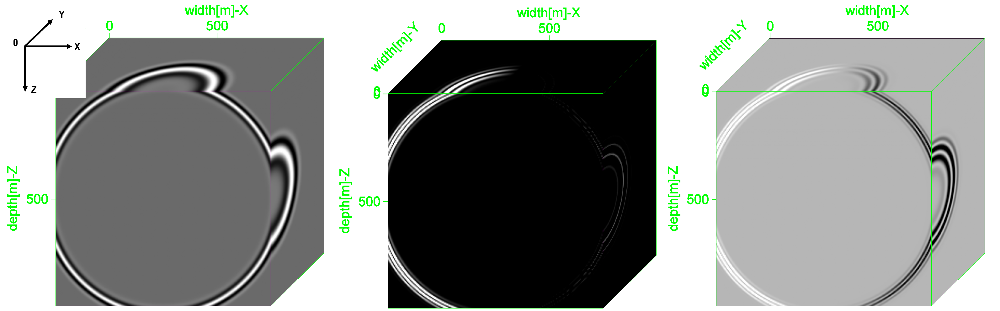

# TI media Finite Different Modeling and Reverse Time Migration

## Aspect

* (2-dimension and 3-dimension)
* anisotropy media (VTI, TTI)
* Reverse Time Migration
* Finite Different Modeling
* Angle Domain Common Imaging Gathers (ADCIGs)
* Poynting vector methods

## Author

[Rong Tao](https://github.com/Rtoax)

## wave equation


## Migration



## poynting vector



## use Laplacian factor tobe a filter decrease the low frequence signal(noise)

```c
/*< linear operator > Copyright(C) Madagascar */
void laplac2_lop(int adj, int nz, int nx, float *in, float *out)
{
    int iz,ix,j;

    for (ix=0; ix < nx; ix++) {
        for (iz=0; iz < nz; iz++) {
            j = iz+ix*nz;

            if (iz > 0) {
            if (adj) {
                out[j-1] -= in[j];
                out[j]   += in[j];
            } else {
                out[j] += in[j] - in[j-1];
            }
            }
            if (iz < nz-1) {
            if (adj) {
                out[j+1] -= in[j];
                out[j]   += in[j];
            } else {
                out[j] += in[j] - in[j+1];
            }
            }

            if (ix > 0) {
            if (adj) {
                out[j-nz] -= in[j];
                out[j]    += in[j];
            } else {
                out[j] += in[j] - in[j-nz];
            }
            }
            if (ix < nx-1) {
            if (adj) {
                out[j+nz] -= in[j];
                out[j]    += in[j];
            } else {
                out[j] += in[j] - in[j+nz];
            }
            }
        }
    }
}
```

## Poynting Vector ADCIGs

```cpp
/**
 *  poynting vector extraction ADCIGs
 *    "Copyright(C) Madagascar:user/pyang/Mrtmadcig.c"
 */
__global__ void Poynting_Adcigs(int nnz,
                                int nx,
                                int nz,
                                int npml,
                                int nangle,
                                int dangle,
                                float *adcigs,
                                float *s_P,
                                float *s_Q,
                                float *s_u,
                                float *s_w,
                                float *g_P,
                                float *g_Q,
                                float *g_u,
                                float *g_w)
{
    int id = threadIdx.x+blockDim.x*blockIdx.x;
    int ix = id/nz;
    int iz = id%nz;

    int ia = 0;

    float Ssx = -s_P[iz+npml+nnz*(ix+npml)]*s_u[iz+npml+nnz*(ix+npml)];
    float Ssz = -s_Q[iz+npml+nnz*(ix+npml)]*s_w[iz+npml+nnz*(ix+npml)];
    float Sgx =  g_P[iz+npml+nnz*(ix+npml)]*g_u[iz+npml+nnz*(ix+npml)];
    float Sgz =  g_Q[iz+npml+nnz*(ix+npml)]*g_w[iz+npml+nnz*(ix+npml)];

    float b1 =  Ssx*Ssx + Ssz*Ssz;
    float b2 =  Sgx*Sgx + Sgz*Sgz;
    float  a = (Ssx*Sgx + Ssz*Sgz)/(sqrtf(b1*b2)*(1 - 0.1));

    if(id<nx*nz) {

        if(a>=-1&&a<=1) {

            a = 0.5*acosf(a)*180.0/pi;
            ia = (int)(a/(dangle*1.0));

            if(ia<nangle) {
                adcigs[iz+nz*ia+nz*nangle*(id/nz)]
                    += s_P[iz+npml+nnz*(ix+npml)]*g_P[iz+npml+nnz*(ix+npml)]
                      *cosf(ia*pi/180.0)*cosf(ia*pi/180.0)*cosf(ia*pi/180.0);
            }
        }
    }
}
```